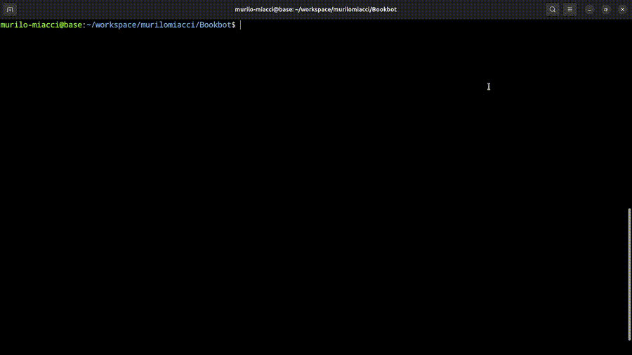

# BookBot

BookBot is my first project from [Boot.dev](https://www.boot.dev)!

## Demo

## Description

Is analyzes a text file, counts every word and alphabetic character,
and displays the results in a sorted list.

The project is written entirely in Python.
